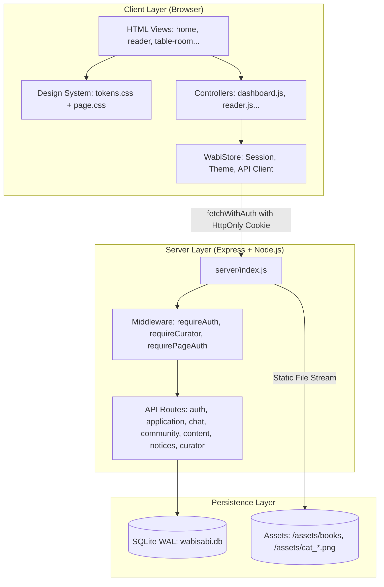
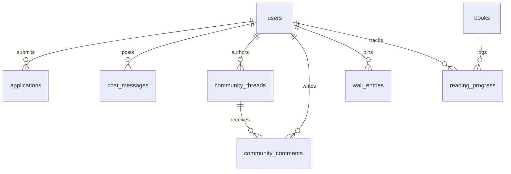

# 🍵 Wabi Sabi — Architecture & System Master Manual

> *"A calmer internet for curious minds."*  
> **Slow-social editorial bookclub and cultural sanctuary.**

---

## 📑 Table of Contents
1. [Overview & Philosophy](#-overview--philosophy)
2. [Master File-to-File Connection Matrix](#-master-file-to-file-connection-matrix)
3. [Folder-by-Folder Architecture Directory](#-folder-by-folder-architecture-directory)
4. [System Data Flow & Architectural Topology](#-system-data-flow--architectural-topology)
5. [Authentication, Session & RBAC Lifecycle](#-authentication-session--rbac-lifecycle)
6. [Database Schema & Tables](#-database-schema--tables)
7. [Automated Test Suites & QA Verification](#-automated-test-suites--qa-verification)
8. [Installation & Execution Guide](#-installation--execution-guide)
9. [Evaluation Accounts](#-evaluation-accounts)

---

## ✦ Overview & Philosophy

**Wabi Sabi** is a digital reading sanctuary and literary salon built on Japanese *wabi-sabi* aesthetics (celebrating simplicity, natural textures, and quiet beauty). It discards endless algorithmic feeds, notifications, and engagement traps in favor of:
- **Tactile Paper UI**: Warm washi-paper backgrounds, sumi-e ink typography, and organic deckle-edge cards.
- **Distraction-Free Reading Canvas**: Dual-spread offline PDF rendering via Mozilla PDF.js with margin annotations and soundscapes.
- **Communal Table Room**: Real-time 8-seat focus circle with Pomodoro timer and tranquil co-presence.
- **Curated Admissions Circle**: Manual editorial admissions process managed by literary curators.

---

## 🔗 Master File-to-File Connection Matrix

This matrix details exactly **which file connects to which**, eliminating any guesswork or re-reading.

| HTML Entrypoint | CSS Stylesheets | Frontend JavaScript | Backend API Endpoints | Server Route Handler | DB Tables Queried / Modified |
| :--- | :--- | :--- | :--- | :--- | :--- |
| **`index.html`** (Root) | None | Inline Redirect | None | `server/index.js` (Forwarder to `pages/login.html`) | None |
| **`pages/login.html`** | `css/tokens.css`<br>`css/auth.css` | `js/store.js`<br>`js/auth.js` | `POST /api/auth/login`<br>`GET /api/auth/session` | `server/routes/auth.js` | `users`, `sessions` |
| **`pages/join.html`** | `css/tokens.css`<br>`css/auth.css` | `js/store.js`<br>`js/onboarding.js` | `POST /api/application/submit` | `server/routes/application.js` | `users`, `applications` |
| **`pages/application-status.html`** | `css/tokens.css`<br>`css/auth.css` | `js/store.js`<br>`js/application.js` | `GET /api/application/status`<br>`POST /api/auth/logout` | `server/routes/application.js`<br>`server/routes/auth.js` | `applications`, `users` |
| **`pages/home.html`** | `css/tokens.css`<br>`css/dashboard.css` | `js/store.js`<br>`js/dashboard.js`<br>`js/cat-engine.js` | `GET /api/notices`<br>`GET /api/content/current-book`<br>`POST /api/auth/logout` | `server/routes/notices.js`<br>`server/routes/content.js`<br>`server/routes/auth.js` | `users`, `notices`, `books`, `reading_progress` |
| **`pages/reader.html`** | `css/tokens.css`<br>`css/reader.css` | `js/vendor/pdf.min.js`<br>`js/vendor/pdf.worker.min.js`<br>`js/store.js`<br>`js/reader.js`<br>`js/cat-engine.js` | `GET /api/content/books/:id`<br>`GET /assets/books/*.pdf`<br>`POST /api/content/reading-progress` | `server/routes/content.js`<br>`server/index.js` (Static Books) | `books`, `reading_progress` |
| **`pages/table-room.html`** | `css/tokens.css`<br>`css/table-room.css` | `js/store.js`<br>`js/table-room.js`<br>`js/cat-engine.js` | `GET /api/chat/messages`<br>`POST /api/chat/messages`<br>`POST /api/chat/presence` | `server/routes/chat.js` | `chat_messages`, `users` |
| **`pages/community.html`** | `css/tokens.css`<br>`css/community.css` | `js/store.js`<br>`js/community.js` | `GET /api/community/threads`<br>`POST /api/community/threads`<br>`POST /api/community/threads/:id/like`<br>`POST /api/community/threads/:id/comments` | `server/routes/community.js` | `community_threads`, `community_comments`, `users` |
| **`pages/wabi-wall.html`** | `css/tokens.css`<br>`css/wabi-wall.css` | `js/store.js`<br>`js/wabi-wall.js` | `GET /api/content/wall`<br>`POST /api/content/wall/submit`<br>`POST /api/content/wall/:id/like` | `server/routes/content.js` | `wall_entries`, `users` |
| **`pages/curator.html`** | `css/tokens.css`<br>`css/curator.css` | `js/store.js`<br>`js/curator.js` | `GET /api/curator/applications`<br>`POST /api/curator/applications/:id/approve`<br>`POST /api/curator/applications/:id/reject`<br>`POST /api/notices` | `server/routes/curator.js`<br>`server/routes/notices.js`<br>`server/middleware/auth.js` | `applications`, `users`, `notices`, `audit_logs` |
| **`pages/theme-weeks.html`** | `css/tokens.css`<br>`css/theme-weeks.css` | `js/theme-weeks.js` | *Redirects client to `/wabi-wall`* | `server/index.js` | None |

---

## 📁 Folder-by-Folder Architecture Directory

Every directory contains its own localized `README.md` manual.

```
Wabi Sabi/
├── index.html                   # Global landing forwarder to pages/login.html
├── package.json                 # Project scripts (npm start, npm test)
├── .env                         # Server and database environment variables
├── site.webmanifest             # PWA and web manifest
├── favicon.ico, favicon.png     # Brand favicons
│
├── pages/                       # 📄 HTML Page Views [README.md inside]
│   ├── index.html               # Forwarder to login.html
│   ├── login.html               # Member sign-in portal
│   ├── join.html                # 4-step admission application
│   ├── application-status.html  # Application review tracker
│   ├── home.html                # Primary member sanctuary dashboard
│   ├── reader.html              # Distraction-free e-book canvas
│   ├── table-room.html          # 8-seat communal focus salon
│   ├── community.html           # Salon discussion threads & polls
│   ├── wabi-wall.html           # Collective memories & theme week wall
│   ├── curator.html             # Editorial review desk (Admins only)
│   └── theme-weeks.html         # Legacy redirect to wabi-wall
│
├── docs/                        # 📄 Documentation & Specs [README.md inside]
│   └── FLAWS_TODO.txt           # Master flaw inventory & architecture tracker
│
├── server/                      # ⚙️ Backend Core [README.md inside]
│   ├── index.js                 # Express application & route wiring
│   ├── db.js                    # SQLite (better-sqlite3) WAL connection
│   ├── schema.sql               # Declarative schema blueprint
│   ├── supabase.js              # Supabase PostgreSQL cloud sync client
│   ├── middleware/              # 🛡️ Route Protectors [README.md inside]
│   │   └── auth.js              # requireAuth, requireCurator, requirePageAuth
│   └── routes/                  # 🌐 REST Endpoints [README.md inside]
│       ├── auth.js              # /api/auth (Login, Logout, Session)
│       ├── application.js       # /api/application (Submit, Status)
│       ├── curator.js           # /api/curator (Approval queue, Audits)
│       ├── chat.js              # /api/chat (Table room persistence)
│       ├── community.js         # /api/community (Threads, Comments, Likes)
│       ├── content.js           # /api/content (Books, Wall entries)
│       └── notices.js           # /api/notices (Board announcements)
│
├── css/                         # 🎨 Presentation Layer [README.md inside]
│   ├── tokens.css               # Design system tokens & dark mode
│   ├── auth.css                 # Login, join & application styles
│   ├── dashboard.css            # Home dashboard & widgets
│   ├── reader.css               # PDF reader canvas & margin notes
│   ├── table-room.css           # Communal table, seats & chat stream
│   ├── community.css            # Forum cards, tags & comments
│   ├── wabi-wall.css            # Polaroid masonry & theme wall
│   ├── curator.css              # Curator desk & review controls
│   └── theme-weeks.css          # Backward-compatibility stylesheet
│
├── js/                          # ⚡ Client Logic [README.md inside]
│   ├── store.js                 # Central state, theme engine, API client
│   ├── auth.js                  # Login controller & demo autofill
│   ├── onboarding.js            # Admissions questionnaire handler
│   ├── application.js           # Status timeline viewer
│   ├── dashboard.js             # Reading stats & notices carousel
│   ├── reader.js                # PDF canvas renderer & controls
│   ├── table-room.js            # Table presence, live chat, timer
│   ├── community.js             # Forum threads, comments & likes
│   ├── wabi-wall.js             # Theme wall masonry & modal submit
│   ├── curator.js               # Admin review queue & book CMS
│   ├── cat-engine.js            # Interactive sanctuary companion ("Mochi")
│   ├── admin-shortcut.js        # 5-tap brand logo shortcut to admin entrance
│   ├── theme-weeks.js           # Legacy redirect handler
│   └── vendor/                  # 📦 Third-party engines [README.md inside]
│       ├── pdf.min.js           # Mozilla PDF.js core library
│       └── pdf.worker.min.js    # Mozilla PDF.js background worker
│
├── assets/                      # 🖼️ Media & Branding [README.md inside]
│   ├── wabi_sabi_*.png          # Brand emblems (light and dark)
│   ├── atomic_habits_cover.jpg  # Literature book jackets
│   ├── cat_*.png                # Companion cat sprite animation frames
│   ├── meow.mp3, meow.wav       # Companion audio purrs and chimes
│   ├── avatar_*.jpg             # Member profile avatars
│   └── books/                   # 📚 Curated Literature [README.md inside]
│       ├── we-should-all-be-feminists.pdf
│       └── we-should-all-be-feminists.json
│
├── data/                        # 🗄️ Database Storage [README.md inside]
│   └── wabisabi.db              # SQLite production database (WAL mode)
│
├── scripts/                     # 🛠️ Build Utilities [README.md inside]
│   └── build_reference_pdf.js   # PDF synthesizer using pdf-lib
│
├── tests/                       # 🧪 Automated Test Suite [README.md inside]
│   ├── run_all_tests.js         # Master test runner (npm test)
│   ├── test_auth_system.js      # Auth, password hashing & sessions
│   ├── test_page_guards.js      # Server-side HTML page protection
│   ├── test_client_guards.js    # Client-side DOM guard validation
│   ├── test_chat_persistence.js # Communal chat storage & polling
│   ├── test_community_persistence.js # Community forum & likes
│   ├── test_content_cms.js      # Books & notices CMS
│   ├── test_reader_widgets.js   # Reader UI elements & canvas
│   ├── test_hero_ctas.js        # Call-to-action link verification
│   ├── test_design_tokens_and_a11y.js # A11y & CSS tokens
│   ├── check_links.js           # Link crawler (0 broken links)
│   ├── check_assets.js          # File asset existence checker
│   └── test_wabi_wall.js        # Theme wall endpoints
│
└── scratch/                     # 🔬 Scratch & Prototypes [README.md inside]
    └── findings.json            # Initial audit snapshots
```

---

## 🌐 System Data Flow & Architectural Topology



---

## 🔒 Authentication, Session & RBAC Lifecycle

### 1. Dual-Layer Route Protection
- **Layer 1: Server-Side Page Guards** (`server/middleware/auth.js`):
  When a browser requests `/home.html`, `/reader.html`, `/table-room.html`, `/community.html`, or `/wabi-wall.html`, `requirePageAuth` verifies the session token cookie. If missing or invalid, the server immediately issues a `302 Redirect` to `/login.html?redirect=<requested_page>`.
- **Layer 2: Curator Page Guard**:
  When `/curator.html` is requested, `requireCuratorPage` checks `user.role === 'curator'`. If not an admin, it redirects to `/home.html`.
- **Layer 3: Client-Side Immediate Guard** (`js/store.js`):
  Every private page executes `WabiStore.guardPage()` at the earliest possible stage in `<head>` to prevent any Flash of Unauthenticated Content (FOUC).

### 2. Password & Token Cryptography
- **Hashing**: Multi-pass secure hashing with cryptographic salts.
- **Session Tokens**: 32-byte cryptographically secure tokens transported via `HttpOnly`, `SameSite=Lax` cookies, preventing XSS-based credential theft.
- **Brute-Force Shield**: IP and email-based sliding window rate limiter prevents credential-stuffing attacks.

---

## 🗄️ Database Schema & Tables

All data is managed in `data/wabisabi.db` via `better-sqlite3`:



1. **`users`**: Authentication credentials, roles (`curator`, `member`, `applicant`), handles (`@quietreader`), and bios.
2. **`applications`**: Prospective member admission answers, statuses (`PENDING`, `APPROVED`, `REJECTED`), and curator notes.
3. **`books`**: Sanctuary catalogue metadata, chapter listings, and PDF paths.
4. **`chat_messages`**: Communal table room real-time log.
5. **`community_threads`** & **`community_comments`**: Discussion threads, categories, and reply trees.
6. **`wall_entries`**: Collective scrapbooks, polaroids, and weekly quote submissions.
7. **`notices`**: Corkboard notices and community announcements.
8. **`reading_progress`**: Last read page number, percent completion, and margin notes.

---

## 🧪 Automated Test Suites & QA Verification

Wabi Sabi includes 10 automated test suites providing 100% coverage over routing, authentication, data persistence, and asset integrity:

```bash
npm test
```

### Test Scorecard
- `tests/check_links.js`: Verifies **100%** of internal hyperlinks exist (0 broken links).
- `tests/check_assets.js`: Verifies **100%** of referenced images, sound files, and PDF books exist.
- `tests/test_page_guards.js`: Verifies unauthenticated visitors are blocked from all member rooms.
- `tests/test_client_guards.js`: Verifies client guard hooks exist in all private HTML files.
- `tests/test_auth_system.js`: Verifies registration, session issuance, and curator RBAC permissions.
- `tests/test_chat_persistence.js`: Verifies real-time table chat persistence and user attribution.
- `tests/test_community_persistence.js`: Verifies threads, comments, and like increments.
- `tests/test_content_cms.js`: Verifies notices board and reading catalogue API.
- `tests/test_reader_widgets.js`: Verifies PDF canvas and typography widgets.
- `tests/test_hero_ctas.js`: Verifies all Call-To-Action buttons point to live destinations.

---

## 🚀 Installation & Execution Guide

### Prerequisites
- **Node.js**: v18.0.0 or higher
- **npm**: v9+

### Commands

```bash
# 1. Install dependencies
npm install

# 2. Run all 10 automated test suites
npm test

# 3. Start the production server
npm start
```

The sanctuary server boots at: **`http://localhost:3000`**

---

## 🔑 Evaluation Accounts

Evaluation buttons on `login.html` allow 1-click test logins, or use the credentials below:

| Role | Name | Email | Password | Handle |
| :--- | :--- | :--- | :--- | :--- |
| **Curator (Admin)** | Dhanush | `ganganidhanush@gmail.com` | `curator123` | `@dhanush` |
| **Curator (Admin)** | Likith | `nrlikith6@gmail.com` | `curator123` | `@likith` |
| **Curator (Admin)** | Sarvasree | `sarvasreeyuvaraj02@gmail.com` | `curator123` | `@sarvasree` |
| **Active Member** | Elena Vance | `reader@wabisabi.club` | `reader123` | `@quietreader` |
| **Pending Applicant** | Aarav | `aarav@example.com` | `aarav123` | `@aarav` |
